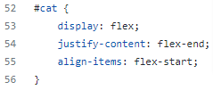

# portfolio-project

## Table of Contents
1. [Description](#description)
2. [Visuals](#visuals)

## Description
[Link to live site](https://nathanhawk2.github.io/portfolio-project/)

Started with HTML and made a header and a footer, then made two articles that carry the bulk of the content, finally adding all hyperlinks and page links. Then onto CSS I formatted the header and footer then positioned photos.

## Visuals

Added an element with an ID to move section to right side of screen

CSS label telling the element to move